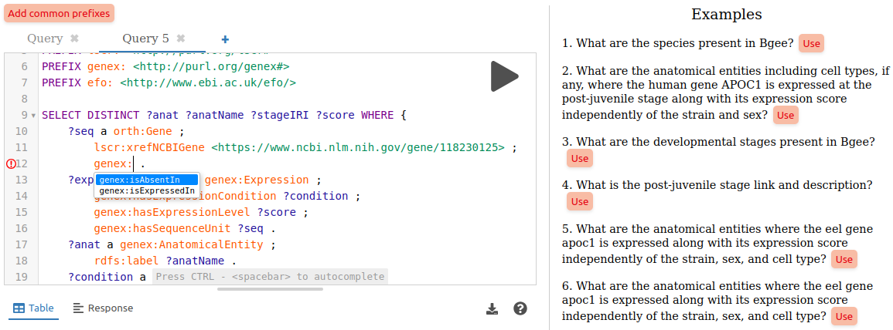

<div align="center">

# 💫 SPARQL editor web component

[](https://www.npmjs.com/package/@sib-swiss/sparql-editor)
[](https://github.com/sib-swiss/sparql-editor/actions/workflows/test.yml)
[](https://github.com/sib-swiss/sparql-editor/actions/workflows/deploy.yml)

</div>

A standard web component to easily deploy a user-friendly SPARQL query editor for one or more endpoints. Built on the popular [YASGUI editor](https://github.com/zazuko/Yasgui), it provides context-aware autocomplete for classes and predicates based on the content of the endpoints.

The editor retrieves metadata about the endpoints by directly querying them, so all that is needed is to generate and upload some metadata to each endpoints, and it works on top of any triplestore without configuration needed. Reducing the need for complex infrastructure, while making your SPARQL endpoints easier to query for users and machines.

- **Autocomplete possibilities for properties and classes** are automatically pulled from the endpoints based on [VoID description](https://www.w3.org/TR/void/) present in the triplestore (`void:linkPredicate|void:property` and `void:class`). The suggested properties are contextually filtered based on the class of the subject at the cursor's position, and are aware of `SERVICE` clauses, ensuring relevant autocompletion even in federated queries. Checkout the [`void-generator`](https://github.com/JervenBolleman/void-generator) project to automatically generate VoID description for your endpoint.

  <details><summary>VoID description is retrieved with a SPARQL query.</summary>

  ```SPARQL
  PREFIX void: <http://rdfs.org/ns/void#>
  PREFIX void-ext: <http://ldf.fi/void-ext#>
  SELECT DISTINCT ?subjectClass ?prop ?objectClass ?objectDatatype
  WHERE {
      {
          ?cp void:class ?subjectClass ;
              void:propertyPartition ?pp .
          ?pp void:property ?prop .
          OPTIONAL {
              {
                  ?pp  void:classPartition [ void:class ?objectClass ] .
              } UNION {
                  ?pp void-ext:datatypePartition [ void-ext:datatype ?objectDatatype ] .
              }
          }
      } UNION {
          ?linkset void:subjectsTarget ?subjectClass ;
              void:linkPredicate ?prop ;
              void:objectsTarget ?objectClass .
      }
  }
  ```

  </details>

- **Example SPARQL queries** defined using the SHACL ontology are automatically pulled from the endpoint (queries are defined with `sh:select|sh:ask|sh:construct|sh:describe`, and their human readable description with `rdfs:comment`). Checkout the [`sparql-examples`](https://github.com/sib-swiss/sparql-examples) project for more details.

  <details><summary>The example queries are retrieved with a SPARQL query.</summary>

  ```SPARQL
  PREFIX sh: <http://www.w3.org/ns/shacl#>
  PREFIX rdfs: <http://www.w3.org/2000/01/rdf-schema#>
  SELECT DISTINCT ?sq ?comment ?query
  WHERE {
      ?sq a sh:SPARQLExecutable ;
          rdfs:comment ?comment ;
          sh:select|sh:ask|sh:construct|sh:describe ?query .
  } ORDER BY ?sq
  ```

  </details>

- **Prefixes** are automatically pulled from the endpoint using their definition defined with the [SHACL ontology](https://www.w3.org/TR/shacl/) (`sh:prefix`/`sh:namespace`).

  <details><summary>The prefixes/namespaces are retrieved with a SPARQL query.</summary>

  ```SPARQL
  PREFIX sh: <http://www.w3.org/ns/shacl#>
  SELECT DISTINCT ?prefix ?namespace
  WHERE { [] sh:namespace ?namespace ; sh:prefix ?prefix }
  ORDER BY ?prefix
  ```

  </details>

👆️ You can **try it** for a few SPARQL endpoints of the SIB, such as UniProt and Bgee, here: **[sib-swiss.github.io/sparql-editor](https://sib-swiss.github.io/sparql-editor)**



---


## 🚀 Use

1. Import from a UNIPROTCDN:

   ```html
   <script type="module" src="https://unpkg.com/@sib-swiss/sparql-editor"></script>
   ```

   Or install with a package manager in your project:

   ```bash
   npm install --save @sib-swiss/sparql-editor
   # or
   pnpm add @sib-swiss/sparql-editor
   ```

2. Use the custom element in your HTML/JSX/TSX code:

   ```html
   <sparql-editor endpoint="https://sparql.uniprot.org/sparql/"></sparql-editor>
   ```

   You can also pass a list of endpoints URLs separated by commas to enable users to choose from different endpoints:

   ```html
   <sparql-editor endpoint="https://sparql.uniprot.org/sparql/,https://www.bgee.org/sparql/"></sparql-editor>
   ```

> [!WARNING]
>
> Metadata are retrieved by a few lightweight queries sent from client-side JavaScript when the editor is initialized, so your SPARQL **endpoints should accept CORS** (either from \*, which is recommended, or just from the URL where the editor is deployed)

### ⚙️ Available attributes

You can customize a few optional attributes when calling the custom element:

- `examples-repo-add-url`: the URL to directly add the query to the git repository where the query examples for this endpoint are stored through the GitHub web UI,
- `examples-repository`: the URL to the git repository where the query examples for this endpoint are stored (automatically generated from `examples-repo-add-url` if you provide it),
- `examples-namespace`: the namespace used when saving a query as example (defaults to the endpoint URL + /.well-known/sparql-examples/ when not specified),
- `examples-on-main-page`: the number of examples displayed on the main page (defaults to 10),
- `add-limit`: the number of rows to be added as limit to the query before being sent, if no limit has been defined by the user (default to none)
- `style="--btn-color / --btn-bg-color"`: buttons color.

You can also provide other HTML elements to be included under the SPARQL examples (e.g. about information and links to relevant resources):

```html
<sparql-editor
  endpoint="https://www.bgee.org/sparql/"
  examples-repo-add-url="https://github.com/sib-swiss/sparql-examples/new/master/examples/Bgee"
  examples-repository="https://github.com/sib-swiss/sparql-examples"
  examples-namespace="https://sparql.uniprot.org/sparql/.well-known/sparql-examples/"
  examples-on-main-page="10"
  add-limit="10000"
  style="--btn-color: white; --btn-bg-color: #00709b;"
>
  <h1>About</h1>
  <p>This SPARQL endpoint contains things</p>
</sparql-editor>
```

### 📝 Basic example

No need for a complex project you can integrate SPARQL editor in any HTML page by importing from a CDN!

Create a `index.html` file with:

```html
<!doctype html>
<html lang="en">
  <head>
    <meta charset="utf-8" />
    <meta name="viewport" content="width=device-width, initial-scale=1" />
    <title>SPARQL editor dev</title>
    <meta name="description" content="SPARQL editor demo page" />
    <link rel="icon" type="image/png" href="https://upload.wikimedia.org/wikipedia/commons/f/f3/Rdf_logo.svg" />
    <!-- Import the module from a CDN -->
    <script type="module" src="https://unpkg.com/@sib-swiss/sparql-editor"></script>
  </head>

  <body>
    <div>
      <sparql-editor
        endpoint="https://www.bgee.org/sparql/"
        examples-repo-add-url="https://github.com/sib-swiss/sparql-examples/new/master/examples/Bgee"
        examples-on-main-page="10"
        style="--btn-color: white; --btn-bg-color: #00709b;"
      >
        <h1>About</h1>
        <p>This SPARQL endpoint contains...</p>
      </sparql-editor>
    </div>
  </body>
</html>
```

Then just open this HTML page in your favorite browser.

You can also start a basic web server with NodeJS or Python (recommended):

```bash
npx http-server
# or
python -m http.server
```

## 🤝 Credits

Thanks to:

- [Triply](https://triply.cc) for originally developing the YASGUI editor
- [Zazuko](https://zazuko.com/) for keeping it up-to-date the last few years
