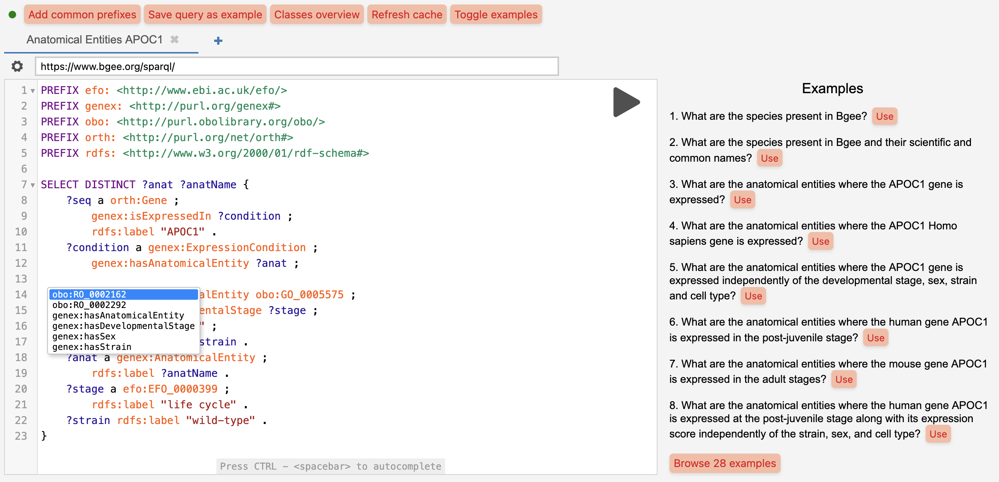

<div align="center">

# 💫 SPARQL editor web component

[](https://www.npmjs.com/package/@sib-swiss/sparql-editor)
[](https://github.com/sib-swiss/sparql-editor/actions/workflows/test.yml)
[](https://github.com/sib-swiss/sparql-editor/actions/workflows/deploy.yml)

</div>

A user-friendly [SPARQL](https://www.w3.org/TR/sparql12-query/) query editor built on the popular [YASGUI editor](https://github.com/zazuko/Yasgui), it provides context-aware autocomplete for classes and predicates based on the content of the endpoints, as well as query examples.

Use it directly for any endpoint at **[sib-swiss.github.io/sparql-editor](https://sib-swiss.github.io/sparql-editor)**.

The editor retrieves metadata about the endpoints by directly querying them, or searching in the SPARQL service description. So all that is needed is to generate and upload some metadata to each endpoints, and it works on top of any triplestore without configuration needed. Reducing the need for complex infrastructure, while making your SPARQL endpoints easier to query for users and machines.

You can also redeploy it for a specific endpoint, or set of endpoints using the standard web component documented below,

## 🪄 Features

- **✨ Autocomplete possibilities for properties and classes** are automatically pulled from the endpoints based on the [VoID description](https://www.w3.org/TR/void/) present in the triplestore. The suggested properties are contextually filtered based on the class of the subject at the cursor's position, and are aware of `SERVICE` clauses, ensuring relevant autocompletion even in federated queries. Checkout the [`void-generator`](https://github.com/JervenBolleman/void-generator) project to automatically generate VoID description for your endpoint.

  <details><summary>Click here to see the SPARQL query used to retrieve the VoID description.</summary>

  ```SPARQL
  PREFIX owl: <http://www.w3.org/2002/07/owl#>
  PREFIX rdfs: <http://www.w3.org/2000/01/rdf-schema#>
  PREFIX sh:<http://www.w3.org/ns/shacl#>
  PREFIX sd:<http://www.w3.org/ns/sparql-service-description#>
  PREFIX void:<http://rdfs.org/ns/void#>
  PREFIX void-ext:<http://ldf.fi/void-ext#>
  SELECT DISTINCT ?graph ?graphLabel ?subjectClass ?prop ?objectClass ?objectDatatype
  ?triples ?subjectClassLabel ?objectClassLabel ?subjectClassComment ?objectClassComment ?propLabel ?propComment
  WHERE {
        {
          OPTIONAL {
            ?graph sd:graph ?graphDesc .
            OPTIONAL { ?graph rdfs:label ?graphLabel }
            ?graphDesc void:classPartition ?cp .
          }
          ?cp void:class ?subjectClass ;
            void:propertyPartition ?pp .
          OPTIONAL { ?subjectClass rdfs:label ?subjectClassLabel }
          OPTIONAL { ?subjectClass rdfs:comment ?subjectClassComment }
          ?pp void:property ?prop .
          OPTIONAL { ?pp void:triples ?triples }
          OPTIONAL { ?prop rdfs:label ?propLabel }
          OPTIONAL { ?prop rdfs:comment ?propComment }
          OPTIONAL {
            {
              ?pp  void:classPartition [ void:class ?objectClass ] .
              OPTIONAL { ?objectClass rdfs:label ?objectClassLabel }
              OPTIONAL { ?objectClass rdfs:comment ?objectClassComment }
            } UNION {
              ?pp void-ext:datatypePartition [ void-ext:datatype ?objectDatatype ] .
            }
          }
        } UNION {
          ?linkset void:subjectsTarget [ void:class ?subjectClass ] ;
            void:linkPredicate ?prop ;
            void:objectsTarget [ void:class ?objectClass ] .
        }
  } ORDER BY ?subjectClass ?objectClass ?objectDatatype ?graph ?triples
  ```

  </details>

- **📜 Example SPARQL queries** defined using the [SHACL ontology](https://www.w3.org/TR/shacl/) are automatically pulled from the endpoint. Checkout the [`sparql-examples`](https://github.com/sib-swiss/sparql-examples) project for more details.

  <details><summary>Click here to see the SPARQL query used to retrieve the example queries.</summary>

  ```SPARQL
  PREFIX sh: <http://www.w3.org/ns/shacl#>
  PREFIX rdfs: <http://www.w3.org/2000/01/rdf-schema#>
  SELECT DISTINCT ?sq ?comment ?query
  WHERE {
      ?sq a sh:SPARQLExecutable ;
          rdfs:comment ?comment ;
          sh:select|sh:ask|sh:construct|sh:describe ?query .
  } ORDER BY ?sq
  ```

  </details>

- **🏷️ Prefixes** are automatically pulled from the endpoint using their definition defined with the SHACL ontology (`sh:prefix`/`sh:namespace`).

  <details><summary>Click here to see the SPARQL query used to retrieve the prefixes/namespaces.</summary>

  ```SPARQL
  PREFIX sh: <http://www.w3.org/ns/shacl#>
  SELECT DISTINCT ?prefix ?namespace
  WHERE { [] sh:namespace ?namespace ; sh:prefix ?prefix }
  ORDER BY ?prefix
  ```

- **🗺️ Overview of classes** using the VoID description.

  </details>


---



## 🚀 Use

1. Install with a package manager in your project:

   ```bash
   npm i --save @sib-swiss/sparql-editor
   ```

   And import in your JS/TS file with:

   ```ts
   import "@sib-swiss/sparql-editor";
   ```

   Or directly import from a CDN:

   ```html
   <script type="module" src="https://esm.sh/@sib-swiss/sparql-editor"></script>
   ```

   Using a fixed version:

   ```html
   <script type="module" src="https://esm.sh/@sib-swiss/sparql-editor@0.2.14"></script>
   ```

2. Use the custom element in your HTML/JSX/TSX code:

   ```html
   <sparql-editor endpoint="https://sparql.uniprot.org/sparql/"></sparql-editor>
   ```

   You can also pass a list of endpoints URLs separated by commas to enable users to choose from different endpoints:

   ```html
   <sparql-editor endpoint="https://sparql.uniprot.org/sparql/,https://www.bgee.org/sparql/"></sparql-editor>
   ```

> [!WARNING]
>
> Metadata are retrieved by a few lightweight queries sent from client-side JavaScript when the editor is initialized, so your SPARQL **endpoints should accept CORS** (either from \*, which is recommended, or just from the URL where the editor is deployed)

### ⚙️ Available attributes

You can customize a few optional attributes when calling the custom element:

- `default-method`: the default method used by YASGUI to query the endpoints (GET or POST, default to GET)
- `examples-repository`: the URL to the git repository where the query examples for this endpoint are stored (automatically generated from `examples-repo-add-url` if you provide it),
- `examples-repo-add-url`: the URL to directly add the query to the git repository where the query examples for this endpoint are stored through the GitHub web UI
- `examples-namespace`: the namespace used when saving a query as example (defaults to the endpoint URL + /.well-known/sparql-examples/ when not specified),
- `examples-on-main-page`: the number of examples displayed on the main page (defaults to 10),
- `add-limit`: the number of rows to be added as limit to the query before being sent, if no limit has been defined by the user (default to none)
- `style="--btn-color / --btn-bg-color"`: buttons color.

```html
<sparql-editor
  endpoint="https://www.bgee.org/sparql/,https://sparql.uniprot.org/sparql/"
  default-method="POST"
  examples-repo-add-url="https://github.com/sib-swiss/sparql-examples/new/master/examples/Bgee"
  examples-repository="https://github.com/sib-swiss/sparql-examples"
  examples-namespace="https://sparql.uniprot.org/sparql/.well-known/sparql-examples/"
  examples-on-main-page="10"
  add-limit="10000"
  style="--btn-color: white; --btn-bg-color: #00709b;"
></sparql-editor>
```

### 🎨 Styling

The web component uses a light DOM, instead of a shadow DOM, to make it easier for the developers to style the application at their convenience, using the usual tool they know: CSS. Just inspect the elements you want to change and write the appropriate CSS.

### 📝 Basic example

No need for a complex project you can integrate SPARQL editor in any HTML page by importing from a CDN!

Create a `index.html` file with:

```html
<!doctype html>
<html lang="en">
  <head>
    <meta charset="utf-8" />
    <meta name="viewport" content="width=device-width, initial-scale=1" />
    <title>SPARQL editor dev</title>
    <meta name="description" content="SPARQL editor demo page" />
    <link rel="icon" type="image/png" href="https://upload.wikimedia.org/wikipedia/commons/f/f3/Rdf_logo.svg" />
    <!-- Import the module from a CDN -->
    <script type="module" src="https://esm.sh/@sib-swiss/sparql-editor"></script>
  </head>

  <body>
    <div>
      <sparql-editor
        endpoint="https://www.bgee.org/sparql/"
        examples-repo-add-url="https://github.com/sib-swiss/sparql-examples/new/master/examples/Bgee"
        examples-on-main-page="10"
        style="--btn-color: white; --btn-bg-color: #00709b;"
      ></sparql-editor>
    </div>
  </body>
</html>
```

Then just open this HTML page in your favorite browser.

You can also start a basic web server with NodeJS or Python (recommended):

```bash
npx http-server
# or
python -m http.server
```

## 🧑‍💻 Contributing

Checkout [CONTRIBUTING.md](https://github.com/sib-swiss/sparql-editor/blob/main/CONTRIBUTING.md) for more details on how to run this in development and make a contribution.

## 🤝 Credits

Thanks to:

- [Triply](https://triply.cc) for originally developing the YASGUI editor
- [Zazuko](https://zazuko.com/) for keeping it up-to-date the last few years
